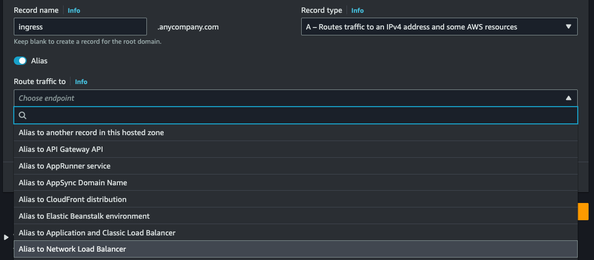
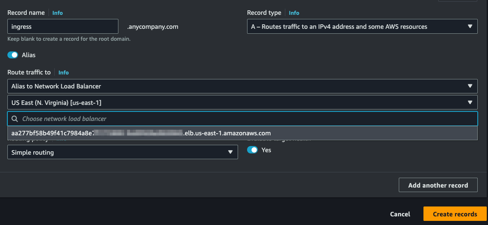

# kubernetes-ingress
## NGINX
[NGINX kubernetes-ingress Github ](https://github.com/nginxinc/kubernetes-ingress)

Docs below are slightly modified from [this](https://docs.nginx.com/nginx-ingress-controller/installation/installation-with-manifests/)

## Pre-Reqs
- aws-cli version 2 (preferably latest) [installation](https://docs.aws.amazon.com/cli/latest/userguide/getting-started-install.html)
- A Kubernetes cluster that you have admin or system:master role
- helm 3 installed

## Installation
1. clone the repository
2. configiure RBAC Role
3. create TLS Secret, ConfigMap and an IngressClass resource
4. create 
5. install service
6. 
### cloning the nginx repo
```console
git clone https://github.com/nginxinc/kubernetes-ingress.git --branch v3.0.2
```
**Note** your branch may vary. 3.0.2 is latest as of 2/14/23
  
### configuring RBAC
1. create a namespace and service account for the controller
```console 
kubectl apply -f common/ns-and-sa.yaml
```
2. create a cluster role and cluster role binding for the service account:
```console
kubectl apply -f rbac/rbac.yaml
```
### configure default TLS secret. nginx ConfigMap, and IngressClass resource
1. Create a secret with a TLS certificate and a key for the default server in NGINX:
```console
kubectl apply -f common/default-server-secret.yaml
```
Note: The default server returns the Not Found page with the 404 status code for all requests for domains for which there are no Ingress rules defined. For testing purposes we include a self-signed certificate and key that we generated. However, we recommend that you use your own certificate and key.

2. Create a config map for customizing NGINX configuration:
```console
kubectl apply -f common/nginx-config.yaml
```
3. Create an IngressClass resource:
```console
kubectl apply -f common/ingress-class.yaml
```
If you would like to set the Ingress Controller as the default one, uncomment the annotation ingressclass.kubernetes.io/is-default-class. With this annotation set to true all the new Ingresses without an ingressClassName field specified will be assigned this IngressClass.
**Note**: The Ingress Controller will fail to start without an IngressClass resource.

### create the custom resources
Note: By default, it is required to create custom resource definitions for VirtualServer, VirtualServerRoute, TransportServer and Policy. Otherwise, the Ingress Controller pods will not become Ready. If you’d like to disable that requirement, configure **-enable-custom-resources** command-line argument to false and skip this section.

1. Create custom resource definitions for VirtualServer and VirtualServerRoute, TransportServer and Policy resources:
```console
kubectl apply -f common/crds/k8s.nginx.org_virtualservers.yaml
kubectl apply -f common/crds/k8s.nginx.org_virtualserverroutes.yaml
kubectl apply -f common/crds/k8s.nginx.org_transportservers.yaml
kubectl apply -f common/crds/k8s.nginx.org_policies.yaml
```
If you would like to use the TCP and UDP load balancing features of the Ingress Controller, create the following additional resources:

2. Create a custom resource definition for GlobalConfiguration resource:
```console
kubectl apply -f common/crds/k8s.nginx.org_globalconfigurations.yaml
```
### finally, lets deploy the controller
Use a Deployment. When you run the Ingress Controller by using a Deployment, by default, Kubernetes will create one Ingress Controller pod.
### Deployment
For NGINX, run:
```console
kubectl apply -f deployment/nginx-ingress.yaml
```
Check to see if the pods are running
Run the following command to make sure that the Ingress Controller pods are running:
```console
kubectl get pods --namespace=nginx-ingress
```
### Service
Create a Service for the Ingress Controller Pods
Use a NodePort service.

Create a service with the type NodePort:
```console
 kubectl create -f service/nodeport.yaml
 ```

Kubernetes will randomly allocate two ports on every node of the cluster. To access the Ingress Controller, use an IP address of any node of the cluster along with the two allocated ports.

Read more about the type NodePort in the Kubernetes documentation.
### AWS Loadbalancer (NLB||ALB)
Use a LoadBalancer service:

Create a service using a manifest for your cloud provider:

For AWS, run:
```console
kubectl apply -f service/loadbalancer-aws-elb.yaml
 ```

notice these annotations in the yaml above. This is what we want to use instead of the Clasic ELB
```console
 annotations:
    service.beta.kubernetes.io/aws-load-balancer-type: "nlb"
    service.beta.kubernetes.io/aws-load-balancer-nlb-target-type: "ip"
```
Kubernetes will allocate a Classic Load Balancer (ELB) in TCP mode with the PROXY protocol enabled to pass the client’s information (the IP address and the port). NGINX must be configured to use the PROXY protocol:

Add the following keys to the config map file nginx-config.yaml from the Step 2:

```console
proxy-protocol: "True"
real-ip-header: "proxy_protocol"
set-real-ip-from: "0.0.0.0/0"
 ```
Update the config map:
```console
kubectl apply -f common/nginx-config.yaml
 ```
Note: For AWS, additional options regarding an allocated load balancer are available, such as the type of a load balancer and SSL termination. Read the Kubernetes documentation to learn more.

View the service changes to the ingress service
```console
kubectl get svc nginx-ingress --namespace=nginx-ingress
[ec2-user@ip-172-31-67-20 ~]$ kubectl -n nginx-ingress get svc
NAME            TYPE           CLUSTER-IP      EXTERNAL-IP                                                                     PORT(S)                      AGE
nginx-ingress   LoadBalancer   10.100.29.233   aa277bf58b49f41c7984a8xxxxxxxxxx-nnnnnnnnnnnnnnn.elb.us-east-1.amazonaws.com   80:32220/TCP,443:30830/TCP   3d21h
```
you can also do a **describe** to see more details
```console
kubectl describe svc nginx-ingress --namespace=nginx-ingress
```
adding the A Record ALIAS for your ingress with the NLB


selecting the AWS Region and NLB DNS Name


### Viewing logs on the ingress for troubleshooting
```console
[ec2-user@ip-172-31-67-20 ~]$ kubectl -n nginx-ingress get pod
NAME                             READY   STATUS    RESTARTS   AGE
nginx-ingress-785fb94488-cc4fk   1/1     Running   0          3d21h
```
tail the logs
```console
kubectl -n nginx-ingress logs nginx-ingress-785fb94488-cc4fk
```
typical output (internet-facing NLB)
```console
172.31.9.49 - - [26/Mar/2023:15:49:16 +0000] "POST / HTTP/1.1" 404 555 "-" "Mozilla/5.0 (X11; Linux x86_64) AppleWebKit/537.36 (KHTML, like Gecko) Chrome/81.0.4044.129 Safari/537.36" "-"
172.31.9.49 - - [26/Mar/2023:15:49:16 +0000] "GET /.env HTTP/1.1" 404 555 "-" "Mozilla/5.0 (X11; Linux x86_64) AppleWebKit/537.36 (KHTML, like Gecko) Chrome/81.0.4044.129 Safari/537.36" "-"
172.31.9.49 - - [26/Mar/2023:15:49:48 +0000] "GET /.env HTTP/1.1" 404 555 "-" "Mozilla/5.0 (X11; Linux x86_64) AppleWebKit/537.36 (KHTML, like Gecko) Chrome/81.0.4044.129 Safari/537.36" "-"
172.31.9.49 - - [26/Mar/2023:15:49:49 +0000] "POST / HTTP/1.1" 404 555 "-" "Mozilla/5.0 (X11; Linux x86_64) AppleWebKit/537.36 (KHTML, like Gecko) Chrome/81.0.4044.129 Safari/537.36" "-"
172.31.9.49 - - [26/Mar/2023:16:14:49 +0000] "GET /.env HTTP/1.1" 404 555 "-" "Mozilla/5.0 (X11; Linux x86_64) AppleWebKit/537.36 (KHTML, like Gecko) Chrome/81.0.4044.129 Safari/537.36" "-"
172.31.9.49 - - [26/Mar/2023:16:14:50 +0000] "POST / HTTP/1.1" 404 555 "-" "Mozilla/5.0 (X11; Linux x86_64) AppleWebKit/537.36 (KHTML, like Gecko) Chrome/81.0.4044.129 Safari/537.36" "-"
2023/03/26 16:19:51 [crit] 22#22: *137157 SSL_do_handshake() failed (SSL: error:14201044:SSL routines:tls_choose_sigalg:internal error) while SSL handshaking, client: 172.31.9.49, server: 0.0.0.0:443
172.31.34.212 - - [26/Mar/2023:16:25:12 +0000] "GET /autodiscover/autodiscover.json?@zdi/Powershell HTTP/1.1" 404 153 "-" "Mozilla/5.0 zgrab/0.x" "-"
2023/03/26 16:39:49 [crit] 21#21: *137640 SSL_do_handshake() failed (SSL: error:14201044:SSL routines:tls_choose_sigalg:internal error) while SSL handshaking, client: 172.31.34.212, server: 0.0.0.0:443
172.31.34.212 - - [26/Mar/2023:16:44:44 +0000] "GET / HTTP/1.1" 404 555 "-" "Chrome/51.0.2704.106" "-"
```
